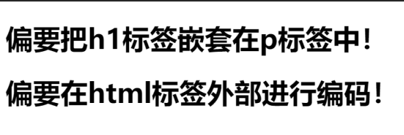
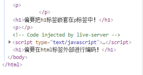

# HTML
## 1. HTML简介
1. HTML(Hypertext Markup Language)**超文本标记语言**；
2. 负责网页三要素之中的结构；
3. 所谓超文本指的是超链接，使用超链接可以让我们从一个页面跳转到另一个页面。

## 2. 编写HTML
```html
<!-- 文档声明，告诉浏览器当前网页为html5 -->
<!DOCTYPE html>
<!-- html的根标签，网页中的所有内容都写在根标签里面 -->
<html lang="en">
<!-- html是网页的元数据，head中的内容不会在网页中直接出现，主要用来帮助浏览器或搜索引擎来解析网页 -->
<head>
    <!-- 通过meta标签来设置网页的字符集，避免乱码问题 -->
    <meta charset="UTF-8">
    <!-- title中的内容会显示在浏览器的标题栏，搜索引擎会主要根据title中的内容来判断网页的主要内容 -->
    <title>Title</title>
</head>
<!-- body是html的子标签，表示网页的主体，网页中所有的可见内容都应该写在body里-->
<body>

    <!-- 网页的一级标题 -->
    <h1>Orange Code</h1>
</body>
</html>
```

## 3. 实体的概念
```html
<!DOCTYPE html>
<html lang="en">
<head>
    <meta charset="UTF-8"> 
    <title>实体</title>
</head>
<body>
    <!-- 
        在网页中编写的多个空格默认情况会自动被浏览器解析为一个空格 
        在HTMl中有些时候，我们不能直接书写一些特殊符号
            比如：多个连续的空格，比如字母两侧的大于和小于号

        如果我们需要在网页中书写这些符号，则需要使用html中的实体（专业字符）
        实体的语法：
            &实体的名字;
            比如空格：&nbsp;
    -->
    <p>
        橙汁&nbsp橙汁a&lt;b&gt;c  &COPY;
    </p>
</body>
</html>
```
更多的字符实体参考[w3school](https://www.w3school.com.cn/html/html_entities.asp)

## 3. meta标签
```html
<!DOCTYPE html>
<html lang="en">
<head>
    <!-- meta主要用于设置网页中的一些元数据，元数据不是给用户看的
        charset 指定网页的字符集
        name 指定的数据的名称
        content 指定的数据的内容

        keywords表示网站的关键字，也就是搜索引擎搜索用户输入的关键字，可以同时指定多个关键字，关键字用英文逗号隔开。
        <meta name="Keywords" content="网上购物,网上商城,手机,笔记本,电脑,MP3,CD,VCD,DV,相机,数码,配件,手表,存储卡,京东"/>
        
        description 用于指定网站的描述  
        <meta name="description"
        content="京东JD.COM-专业的综合网上购物商城,销售家电、数码通讯、电脑、家居百货、服装服饰、母婴、图书、食品等数万个品牌优质商品.便捷、诚信的服务，为您提供愉悦的网上购物体验!"/>      
        网站的描述会显示在搜索引擎的搜索的结果中

        refresh 表示几秒后重定向到某个网站

        title标签的内容会作为搜索结果的超链接上的文字显示
    -->
    <meta charset="UTF-8">
    <meta name="Keywords" content="wczy blog,Orange Code,伍城志个人博客">
    <meta name="description" content="学习记录，知识分享">
    <!-- 3秒后重定向到百度 -->
    <meta http-equiv="refresh" content="3;url=https://www.baidu.com">
    
    <title>Document</title>
</head>
<body>
    
</body>
</html>
```

## 4.语义化标签
```html
<!DOCTYPE html>
<html lang="en">
<head>
    <meta charset="UTF-8">
    <title>Document</title>
</head>
<!-- 
    在页面中独占一行的元素称为块元素
    在页面中不会独占一行的元素称为行内元素
-->
<body>
    <!-- 标题标签：
        h1~h6，一共有六级标签
        从h1~h6重要性递减，h1在网页中的重要性仅次于title标签，一般情况下一个页面只会有一个h1
        标题标签是都是块元素    
    -->
    <h1>一级标题</h1>
    <h2>二级标题</h2>
    <h3>三级标题</h3>
    <h4>四级标题</h4>
    <h5>五级标题</h5>
    <h6>六级标题</h6>

    <!-- 
        hgroup标签用来标题分组，可以将一组相关的标题同时放到hgroup中
     -->
     <hgroup>
         <h1>我的好朋友</h1>
         <h2>周杰</h2>
         <h2>刘禹</h2>
     </hgroup>
    <!-- 
        p标签表示页面的一个段落，p标签也是一个块元素
     -->
    <p>p标签中的内容就表示一个段落</p>
    <p>p标签中的内容就表示一个段落</p>

    <!-- 
        em标签用于表示语音语调的一个加重，是一个行内元素
     -->
     <p>我是真的太<em>帅</em>了</p>

     <!-- 
         strong标签表示强调，重要内容,也是一个行内元素
      -->
      <p>我还挺<strong>高</strong>的</p>

      <!-- 
          blockquote标签，表示一个长引用，是一个块元素
       -->
       橙汁说：<blockquote>一千万真的就轻轻松松的啊</blockquote>
       <!-- 
           q标签，表示一个短引用，是一个行内元素
         -->
       子曰<q>三人行，必有我师焉</q>

       <!-- 
           br标签，页面内换行
        -->
       <br>
       <br>
       明天还要上班
</body>
</html>
```

## 5. 块标签和行类标签
```html
<!DOCTYPE html>
<html lang="en">
<head>
    <meta charset="UTF-8">
    <meta name="viewport" content="width=device-width, initial-scale=1.0">
    <title>Document</title>
</head>
<body>
    <!-- 
        块元素：在网页内一般通过块元素来对页面进行布局
        行内元素：行内元素主要用来包裹文字

        一般情况下会在块元素中放行内元素，而不会在行内元素中放块元素
        但是款元素中基本上什么都能放，也存在特例，比如p元素中不能放任何块元素

        如果网页中存在不规范的内容，浏览器在解析网页时会进行修正！
        （长大了才知道都是浏览器在惯着我，老暖男了）
            比如：
                标签写在了根元素的外部
                p标签中嵌套了块元素
                根元素中出现了除head和body之外的子元素
                ...
     -->
     <p>
         <h1>偏要把h1标签嵌套在p标签中！</h1>
     </p>
</body>
</html>
<h1>偏要在html标签外部进行编码！</h1>
```
上面的代码是不符合规范的，但是打开此html页面会发现依然显示正常：



这就是因为浏览器会自动修正我们的代码，在内存中我们可以很清楚的看到：



## 6. 布局标签
1. header标签，表示网页的头部。
2. main标签，表示网页的主体部分，一个页面中只会有一个main。
3. footer标签，表示网页的底部。
4. nav标签，表示网页中的导航。
5. aside标签，表示和主体相关的其他内容（侧边栏）
6. section标签，表示独立的一个区块，上面的标签都不能表示时使用此标签。

现在实际开发中，还是大部分的使用div标签和span标签：
1. div标签，没有意义，就用来表示一个区块，目前来讲div还是主要的布局元素。
2. span标签，行内元素，没有任何语义，一般用于在网页中选中文字。
